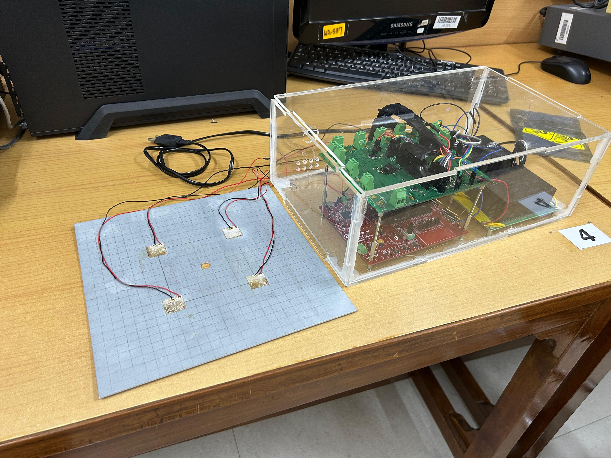
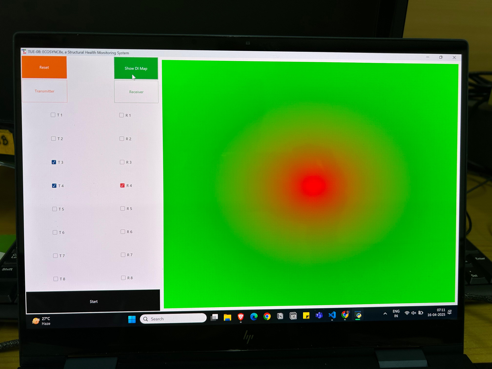
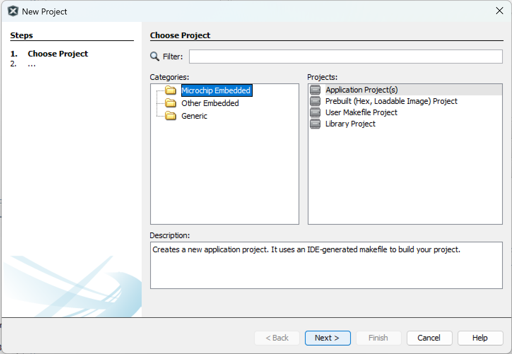
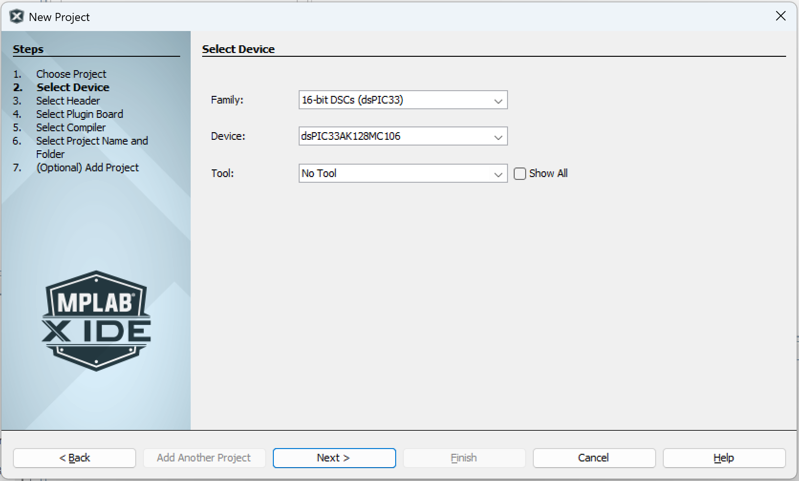
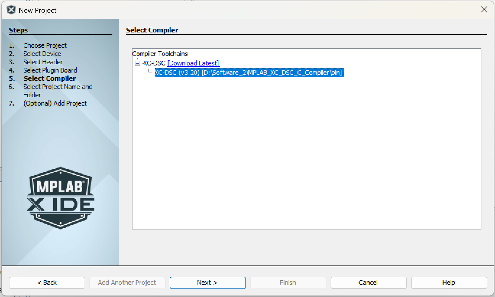
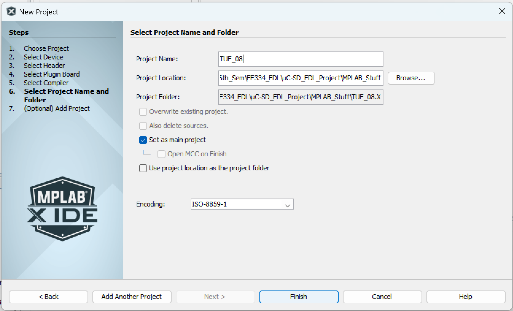
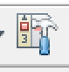
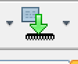

<!-- Modify from here -->
# Project Overview    


### Project Name: *EcoSync 8X* - A dsPIC33A microcontroller based ultrasonic guided wave structural health monitoring system
### Team Number: TUE-08

### Team Members:  
(in alphabetical order)
- **[Amol Pagare](https://github.com/Amolpagare10)**
- **[Angad Singh](https://github.com/lightning-starboy)**  
- **[Anuj Gautam](https://github.com/10Anuj)**  
- **[Anuj Yadav](https://github.com/anujyadav10457)**  
- **[Subhanshu Choudhary](https://github.com/Subhanshu-Leo)**

## Problem Statement and Solution

This project introduces an **embedded data acquisition system** using **ultrasonic guided wave–based structural inspection**. The system is built around an **8-channel transducer interface**, where each channel can be dynamically configured as either a **transmitter** or **receiver**, enabling flexible and reconfigurable testing setups—all controlled via a user-friendly **graphical user interface (GUI)**.This is the device [User Manual.](others/USER_MANUAL.pdf)

  



---

### Key Features:

- **Signal Generation**: Produces a 100 kHz, 5-cycle Hanning-windowed pulse with a 10 V<sub>pp</sub> amplitude, which can be amplified up to 100 V<sub>pp</sub> using an external power amplifier.
- **Receiver Signal**: Includes high-fidelity signal acquisition with instrumentation amplifiers for accurate and noise-reduced signal capture.
- **Channel Multiplexing**: Supports 8-channel multiplexing for dynamic selection of transmitter and receiver transducers.
- **Wireless Communication**: Enables real-time data transmission to a host computer for visualization and offline analysis.
- **Structural Health Monitoring**: Ideal for applications in pipelines, metal and composite panels, and other critical infrastructure requiring long-term monitoring and inspection.
  <!--  -->

## 1. Source Code
### Project Directory Structure

```
/Project-Root
├── /src                      # Source code folder
│   ├── /dspic33ak128MC106      # Microcontroller 1
│   │   ├── integrated.c          # Handles DAC and ADC functionality
│   │   ├── command_protocol.c    # Implements the command protocol logic
│   │   ├── protocol_def.h        # Definitions for the command protocol
│   │
│   ├── /esp32                  # Microcontroller 2
│   │   ├── wifi_code.ino         # WiFi setup and communication code
```

### Programming the Microcontrollers

For programming the **dsPIC33AK128MC106** microcontroller, we used **MPLAB X IDE** in combination with the **XC-DSC compiler**.  
For the **ESP32** module, the programming was done using the **Arduino IDE**.  
In both cases, the code was written in the **C programming language**.

---

### How to Use the Code

### 1. Install Required Tools

- **MPLAB X IDE**: The official integrated development environment provided by Microchip for developing and debugging embedded applications.
- **XC-DSC Compiler**: A compiler specifically designed for 16-bit Digital Signal Controllers (DSCs) like the dsPIC33 series.

Both tools can be downloaded from the Microchip website:  
[https://www.microchip.com/en-us/tools-resources/develop/mplab-x-ide](https://www.microchip.com/en-us/tools-resources/develop/mplab-x-ide)

---

### 2. Creating a New Project in MPLAB X IDE

Once the tools are installed, follow these steps to create and configure a new project for the dsPIC33AK128MC106:

1. **Launch MPLAB X IDE**.
2. Go to the **File** menu and select **New Project**.
3. In the project wizard:
    - Select **Microchip Embedded** under **Categories**
    - Select **Application Projects** under **Projects**  
      
4. Click **Next**, then:
    - Choose **16-bit DSCs (dsPIC33)** from the **Family** dropdown
    - Select **dsPIC33AK128MC106** from the list of devices  
      
5. Click **Next**, then choose the **XC-DSC** compiler from the list of available compilers  
   
6. Provide a name for your project and choose a directory where it will be saved  
   

---

### 3. Adding Source Code Files

Once your project is set up:

1. In the **Projects** tab within MPLAB X IDE, navigate to the `Source Files` folder.
2. Copy and paste the provided `.c` and `.h` files into the `Source Files` directory.  
   

---

### 4. Building and Programming the Device

To compile and upload your code:

1. Click on the **Build Project** button (hammer icon) in the toolbar to compile the code.  
   
2. After a successful build, click the **Make and Program Device** button (downward arrow icon) to upload the code to the microcontroller.  
   
3. Once the microcontroller is programmed successfully, the onboard **status LED** should start blinking, indicating that the code is running.

---

## 2. PCB Design
```
/Project-Root
├──pcb/
|  ├── pictures/                         # Existing folder
|  ├── 1N914.zip                         # Diode library
|  ├── LIB_23LCV04M-I_ST.zip            # Official library
|  ├── LIB_DAC7821IPWR.zip              # Official DAC library
|  ├── MAX1426EAI_.zip                  # ADC or other component library
|  ├── Readme.md                        # Main documentation or instructions
|  ├── design.kicad_pcb                 # KiCAD PCB layout
|  ├── design.kicad_pro                 # KiCAD project file
|  ├── design.kicad_sch                 # KiCAD schematic file
|  ├── ul_DAC7821IPW.zip                # User-provided DAC library
|  ├── ul_INA128U.zip                   # User-provided instrumentation amp
|  ├── ul_TL072CP.zip                   # User-provided op-amp library
```
We've made our PCB using KiCAD software and these are the footprints used in the PCB design.

## 3. Laser Cut Panels
### Enclosure Design and Fabrication

The enclosure for our project was custom-designed and fabricated using **laser cutting**. All design files are located in the `/3d_models` directory. The box design was created using **Autodesk Fusion 360** and exported as a **DXF file** suitable for laser cutting.
```
/Project-Root
├── /3d_models              # 3D models and laser cut files
│   ├── box_model.dxf         # DXF file with all 6 faces for laser cutting
│   ├── Box_CAD_Sketch.png    # Sketch preview of the box design
```

### Box Details

- The enclosure consists of **six interlocking acrylic panels**, each precisely designed with **notches** that fit into complementary notches on adjacent panels for seamless assembly.
- Panels are cut from **5 mm thick acrylic sheets**.
- The box is assembled using **hot glue**, which securely holds the panels together.

---

### Custom Cutouts

- **Back Panel**:
  - Includes a cutout for the **power supply**.
- **Side Panel**:
  - It has a cutout specifically for the **dsPIC33AK128MC106 microcontroller board**.
  - Below the microcontroller cutout, there are **eight holes** for the **transducer connectors**, allowing easy interfacing with the external sensors.

## 4. Bill Of Materials  
This project involves various electronic components including microcontrollers, converters, sensors, and support modules, sourced from vendors like DigiKey, Robu, Mouser, and Microchip.

### Component Overview

| **Category**               | **Component**                             | **Quantity** | **Vendor**              | **Cost (INR)** |
|---------------------------|-------------------------------------------|--------------|--------------------------|----------------|
| **Microcontrollers & Dev Boards** | ESP32 WiFi Module, DIM Module, Development Board | 3            | DigiKey, Microchip       | ₹9,457.00      |
| **Signal Conversion**     | DAC, ADC, INA128                          | 3            | Mouser, DigiKey, Robu    | ₹1,910.00      |
| **Power Modules**         | SMPS (x2), Buck & Boost Converters       | 5            | DigiKey, Robu            | ₹4,420.00      |
| **Sensors**               | PZT Sensor (SP-5H)                        | 8            | CPS Lab                  | ₹40,000.00     |
| **Misc ICs**              | MUX, Electronic Switch, Opamp            | 3            | Mouser, DigiKey, Robu    | ₹2,675.00      |
| **Mechanical**            | Acrylic Sheet Panels (Laser Cut)         | 6            | WEL                      | NA             |

---

### **Total Cost**: ₹58,462.00

> Note: Cost for acrylic sheets not included.


## **Learning, Experiences, Hardships, and Difficulties Encountered**

<!-- This course has been a valuable learning experience for us. It taught us how to transform an idea into a tangible product, which was both challenging and exciting. Throughout the project, we experienced highs when things were progressing smoothly, when our DAC wasn't giveing the correct waveform, as well as lows when nothing seemed to work despite our efforts, when our ADC couldnt't work reliably. There were moments of frustration, especially when technical setbacks slowed us down or when not all team members could contribute equally due to other academic commitments, even when we had quizes and exam, we tried to invest some time according to our free timings. In hindsight, we believe a more effective distribution of tasks could have helped us manage these challenges better. Nonetheless, the journey was immensely enriching, and we’re grateful for the opportunity to learn and grow through this experience. -->


This course has been a valuable learning experience for us. It taught us how to transform an idea into a tangible product, which was both challenging and exciting. 

Throughout the project, we experienced several highs—such as when things were progressing smoothly—and lows, like when our DAC wasn't giving the correct waveform or when our ADC couldn’t work reliably. 

There were moments of frustration, especially when technical setbacks slowed us down or when not all team members could contribute equally due to other academic commitments. Even during quizzes and exams, we tried to invest time according to our free schedules.

In hindsight, we believe a more effective distribution of tasks could have helped us manage these challenges better. Nonetheless, the journey was immensely enriching, and we’re grateful for the opportunity to learn and grow through this experience.


## Current status and Future Prospects for our Project

---

### 1. Partially Incomplete ADC

#### What Was Done:
- Tested the ADC on the PCB using waveform inputs from the INA.
- Output signal remained constant across tests.
- Tried using an earlier-working ADC on a breadboard—still observed a constant output.

#### Unresolved Issues:
The root cause remains unidentified. Potential issues could include:
- Incorrect voltage reference.
- INA output entering saturation.
- Firmware misconfiguration.
- Inaccurate or missing clock signals.

#### Parts Not Completed:
- Full integration of the ADC into the signal chain.
- Validation using real digitized sensor data.
- Establishing a complete end-to-end data acquisition pipeline for signal processing.

---

### 2. Partially Incomplete Wi-Fi Module Interface

#### What Was Done:
- Attempted UART-based interfacing of the Wi-Fi module with the Curiosity board.
- Identified that the UART pins on the board were non-functional.

#### Progress Made:
- Successfully interfaced the Wi-Fi module with a GUI.
- Enabled both data transmission and reception.
- Initially received garbage data when connected to a laptop, resolved by:
  - Splitting the code into two modules:
    - One for the Wi-Fi module at **115200 baud rate**.
    - One for laptop communication at **9600 baud rate**.

#### Parts Not Completed:
- Wi-Fi integration with the Curiosity board.
- Wireless transmission of sensor data from the MCU.
- Real-time wireless data logging and remote visualization.

---

## Future Prospects

### 1. Enhanced GUI Interface
- Develop a more intuitive and interactive GUI.
- Key features to include:
  - Real-time waveform plotting.
  - Diagnostic alerts for system anomalies.
  - Interactive signal control and parameter tuning.

### 2. DI Map Algorithm Improvements
- Optimize the **Damage Index (DI)** mapping algorithm for better defect localization and embedded performance.
- Add a validation metric to evaluate and improve accuracy.
- Enable dynamic updates on the GUI for visual feedback.

### 3. Complete Wi-Fi Module Integration
- Finalize integration of the Wi-Fi module with the Curiosity board.
- Support seamless, real-time wireless data transmission.
- Enable remote monitoring through a web interface or mobile application.

### 4. SRAM-Based Memory Expansion
- Integrate external **SRAM** to overcome microcontroller memory limitations.
- Support:
  - High-resolution signal logging.
  - Buffered data acquisition.
  - Advanced signal processing tasks on-device.

---
