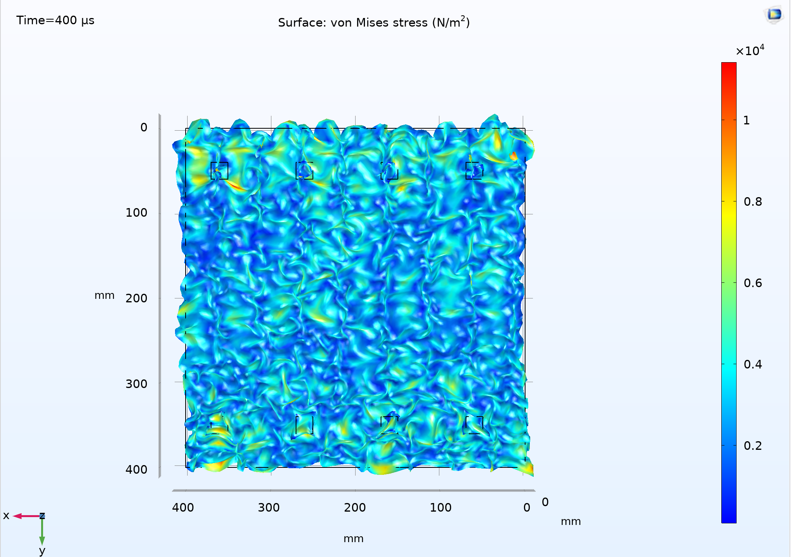
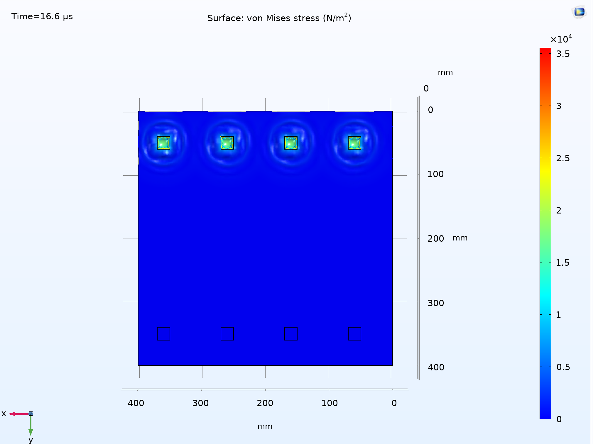
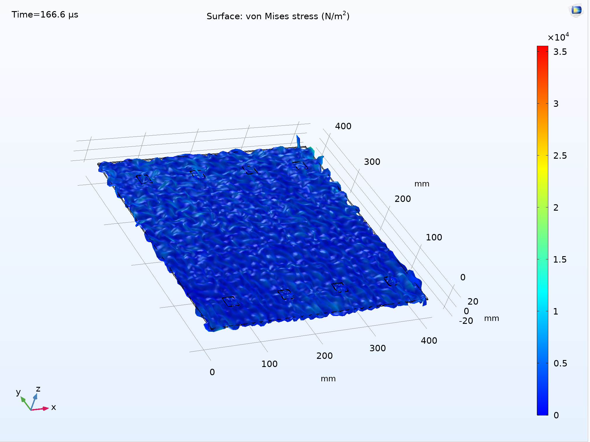
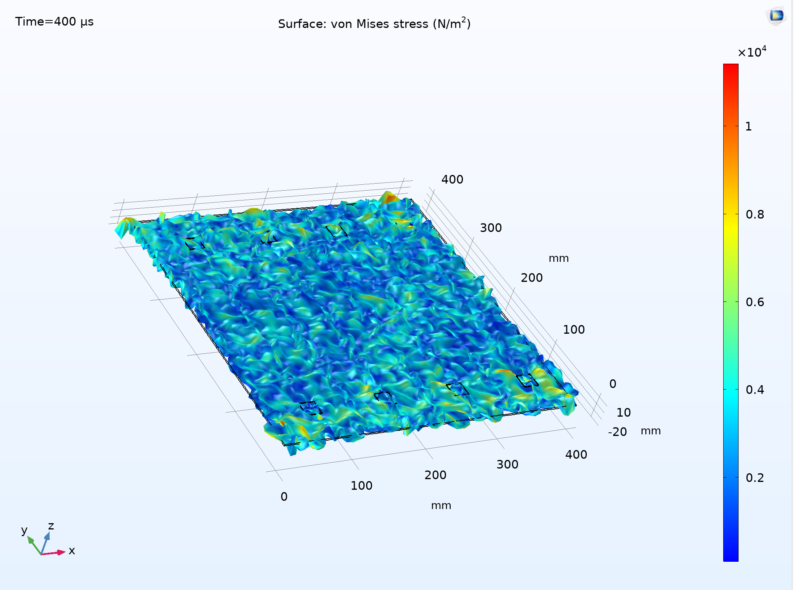

# Piezoelectric Sensor Excitation Simulations (COMSOL)

This repository contains simulation results from **COMSOL Multiphysics** illustrating various excitation scenarios of piezoelectric sensors embedded on a solid structure. The aim of these simulations is to study wave propagation and stress distribution in the material in response to controlled excitations.

---

## Overview

Piezoelectric sensors are commonly used in **Structural Health Monitoring (SHM)** systems to detect and localize defects through guided wave techniques. This project investigates how different excitation methods and sensor placements affect wave propagation and energy concentration in a simulated environment.

---

## Simulation 1

**Description:**  
This image shows wave propagation across the plate after excitation via PZT sensors, observed when the plate is placed flat.

---

## Simulation 2

**Description:**  
This snapshot captures the state of the plate 16.6µs after excitation of all four PZT sensors.

---

## Simulation 3

**Description:**  
At 166.6µs, guided waves have begun traversing the plate and the wavefronts are clearly visible.

---

## Simulation 4

**Description:**  
This image represents the final stage where guided waves have propagated across the entire plate at 400µs after excitation.

---
