# Breadboard Testing Results

This document summarizes the testing stages and results of different components in the system including the Command Protocol, DI Map Algorithm, DAC Output, Electronic Switch, Multiplexer, and Instrumentation Amplifier (INA).

---

## Command Protocol

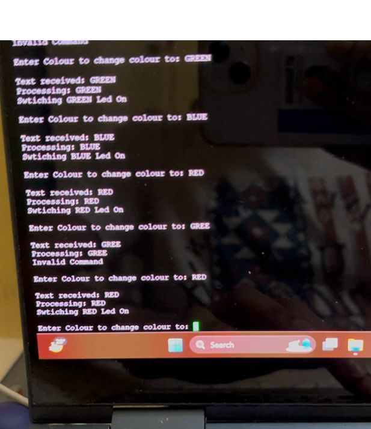

The above image shows the testing of our **Command Protocol**. The protocol is functioning correctly, as the appropriate LED lights up when the corresponding command is sent to the microcontroller. This confirms successful communication and command parsing.

---

## DI Map Algorithm

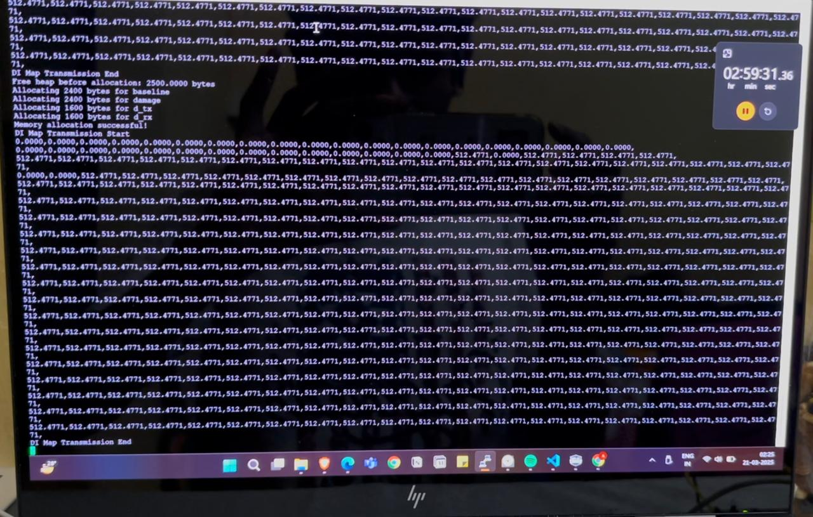

The **DI Map Algorithm** computes the **Damage Indices (DI)** for each coordinate in the grid. The testing confirms the algorithm accurately maps the DIs, ensuring reliable diagnostics of the structural health for each node in the system.

---

## DAC Output

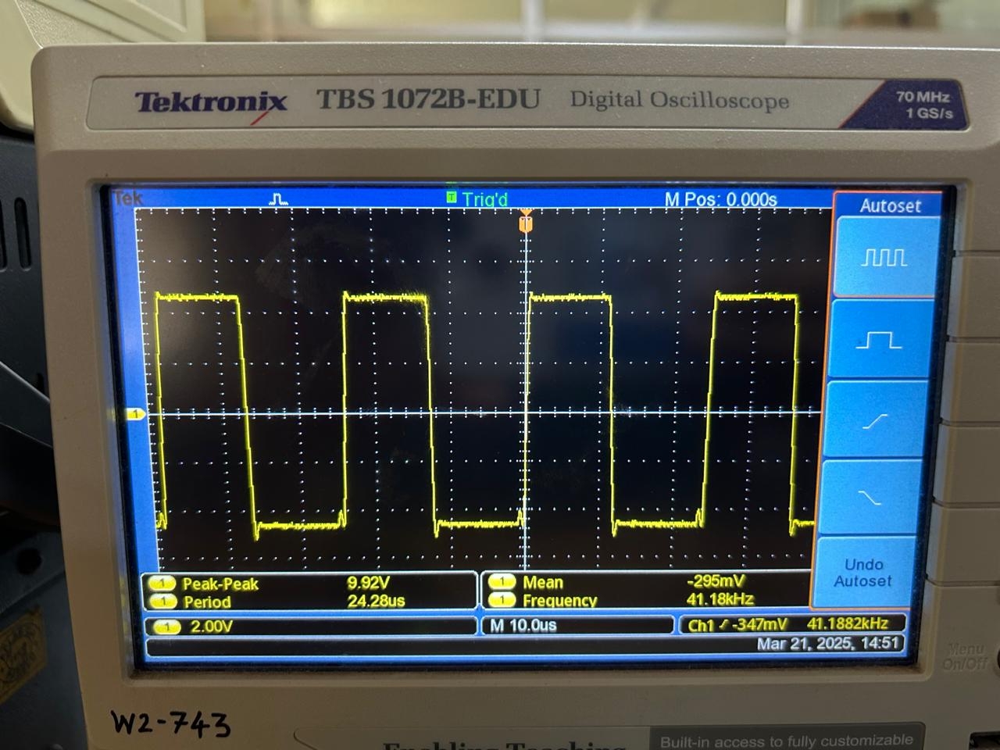  
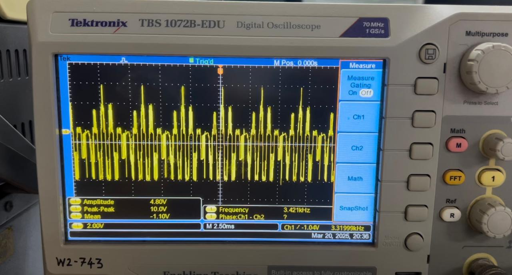

The above images display intermediate testing results of the **Digital-to-Analog Converter (DAC)** output. Two waveform types were tested:
- A **square wave**
- A **Hanning pulse**

These waveforms were successfully generated, indicating that the DAC configuration and output logic are functioning as intended.

---

## Electronic Switch

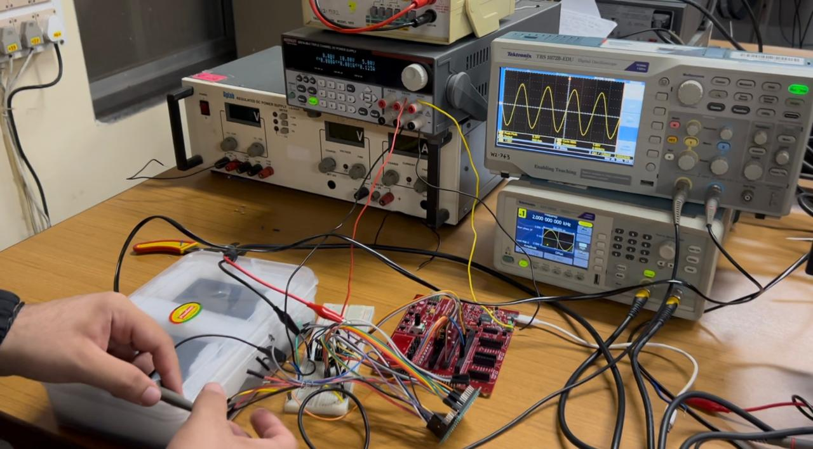  
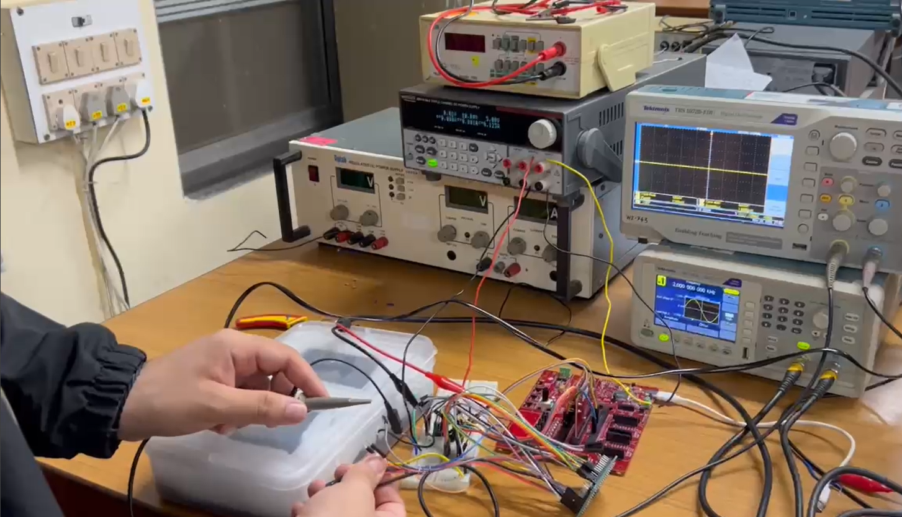

The images above show the **Electronic Switch** test results. Upon correct selection of the switch, the appropriate waveform is transmitted to the DAC. This validates the proper operation of the switch selection and signal routing mechanism.

---

## Multiplexer (MUX)

### MUX 1

**Input:**  
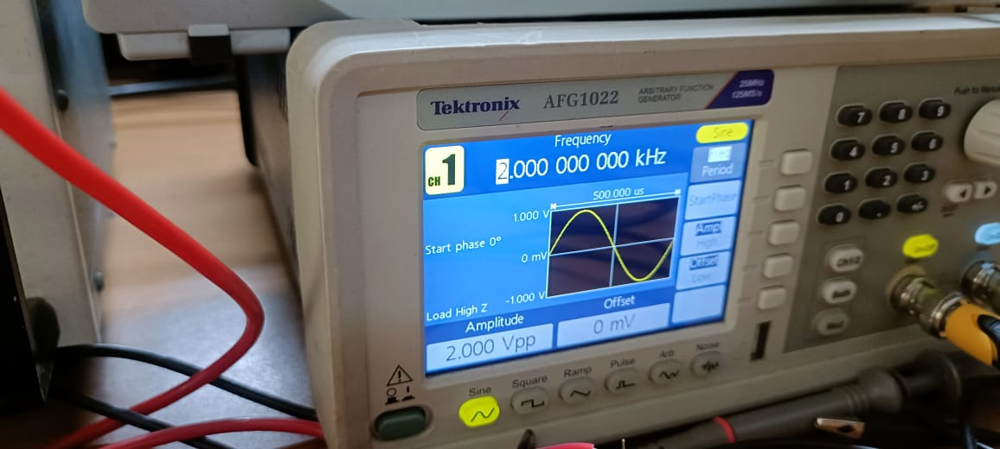  

**Output:**  
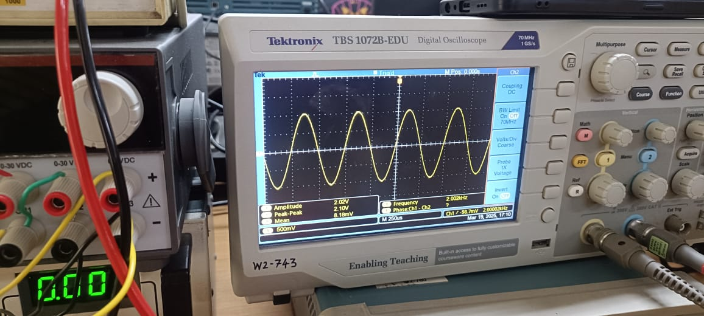  

### MUX 2

**Input:**  
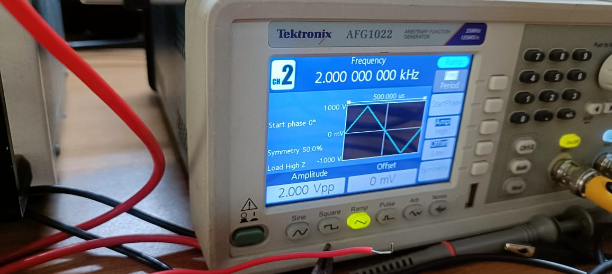  

**Output:**  
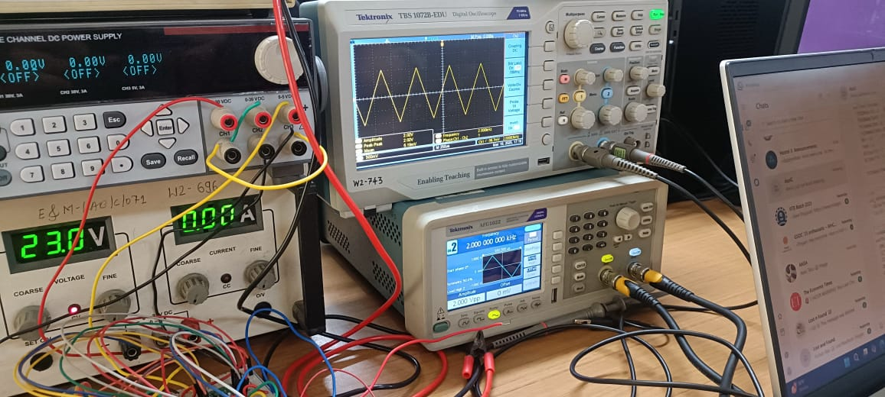

The above results demonstrate the functionality of the **Multiplexer (MUX)**. For both MUX 1 and MUX 2, the output waveforms correspond correctly with the selected inputs, validating the signal selection and transmission through the MUX circuitry.

---

## Instrumentation Amplifier (INA)

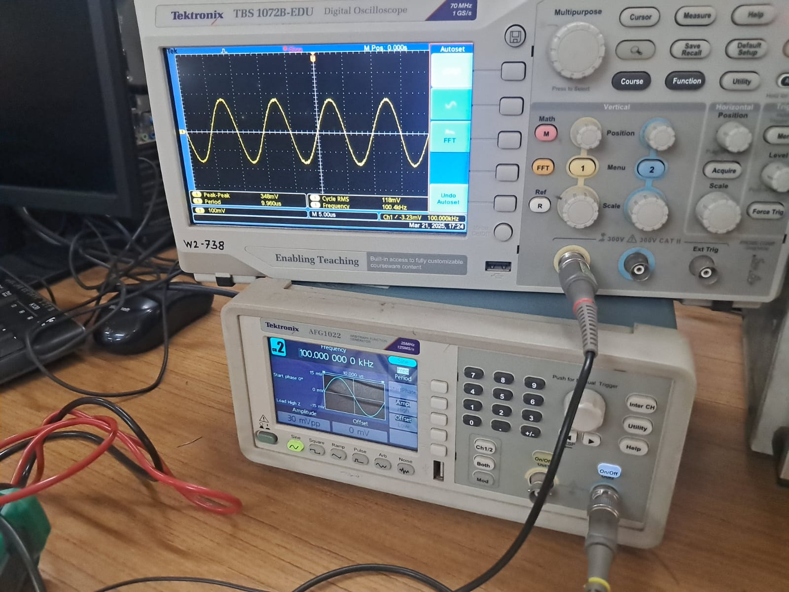  
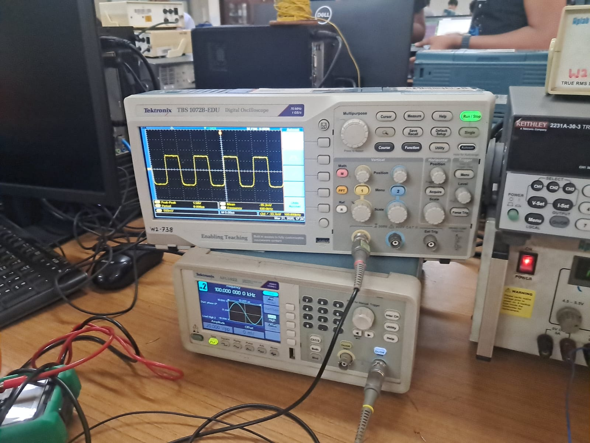

The **Instrumentation Amplifier (INA)** testing is shown above:
- The **first image** confirms that when the voltage is below the threshold level, the signal is not clipped.
- The **second image** shows that once the voltage exceeds the threshold, the signal is correctly clipped.

This behavior confirms that the INA is performing the expected threshold-based signal conditioning.

---

## Summary

All components of the system have been individually tested and verified:
- Command Protocol and DI Mapping Logic are functioning correctly.
- DAC outputs accurate waveforms.
- Electronic Switch and MUX route signals correctly.
- INA clips signals only when threshold is crossed.
