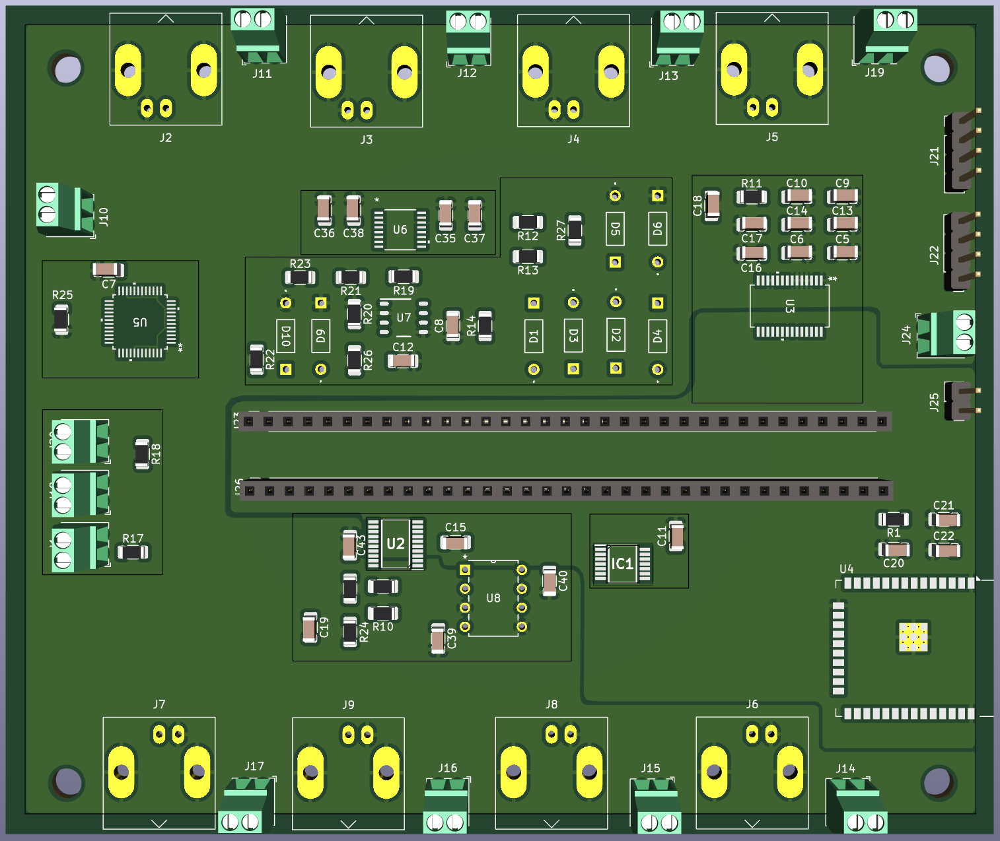
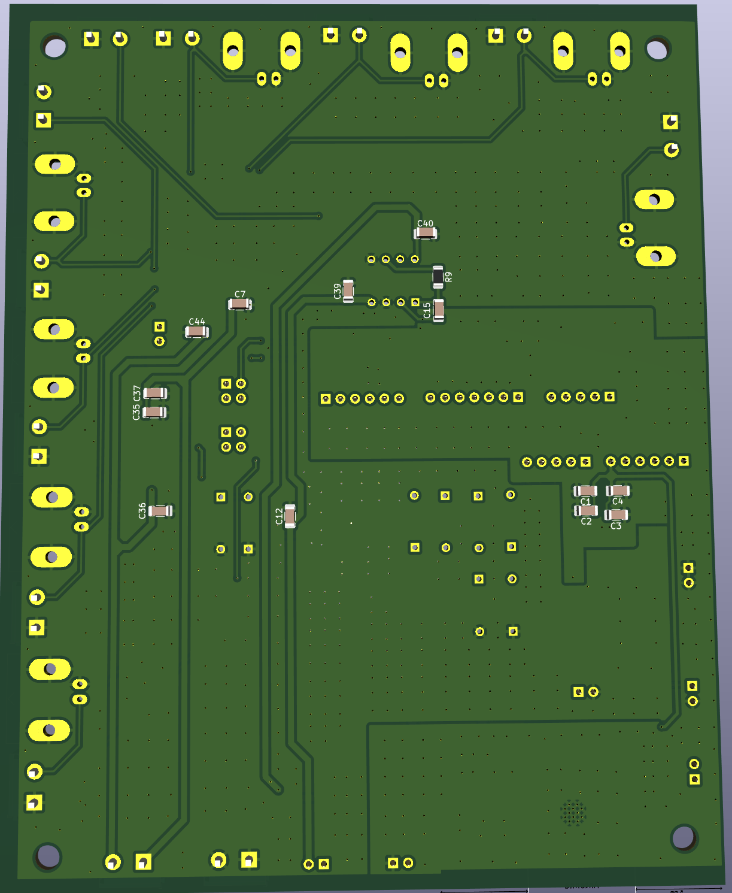
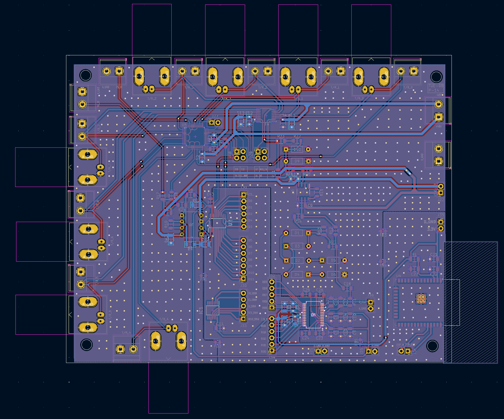
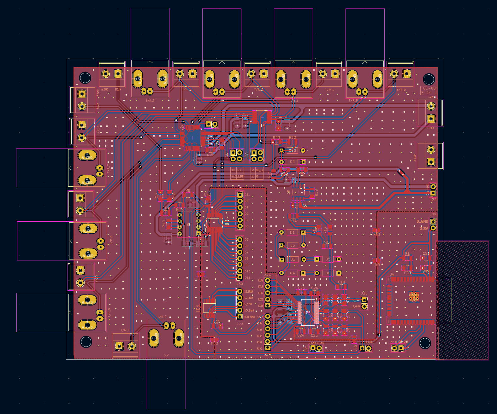

## PCB Design and Layout

This section showcases the **Printed Circuit Board (PCB)** design and layout for the system. The PCB was meticulously designed to integrate all key components such as the microcontroller, DAC, multiplexer, electronic switch, and supporting circuits, while maintaining a compact and efficient footprint.

---

### 3D Rendered Views

The following images show 3D representations of the fabricated PCB, providing a clear understanding of the component placement and structural design:

     

- These 3D images help in visualizing the final assembly of the hardware.
- Components are placed logically to optimize signal routing and minimize interference.
- The design ensures that all connectors and test points are accessible for debugging and verification.

---

### PCB Layout (Top and Bottom Views)

The images below display the PCB layout used for fabrication, including the routing of tracks, via placement, and component outlines.

     
 

- The **first layout** image highlights the **top copper layer**, showing signal traces and footprints of surface-mounted and through-hole components.
- The **second layout** shows the **bottom layer**, including ground fills, power routing, and additional signal traces.

These layouts were exported from the PCB design tool post-routing and silkscreen labeling. Care was taken to follow **design-for-manufacturing (DFM)** and **design-for-test (DFT)** guidelines to ensure reliable production and ease of testing.

---

### Summary

The PCB design phase has been successfully completed with:
- Optimized layout for signal integrity and power distribution.
- Verified component placement via 3D views.
- Clearly separated analog and digital sections for noise reduction.

