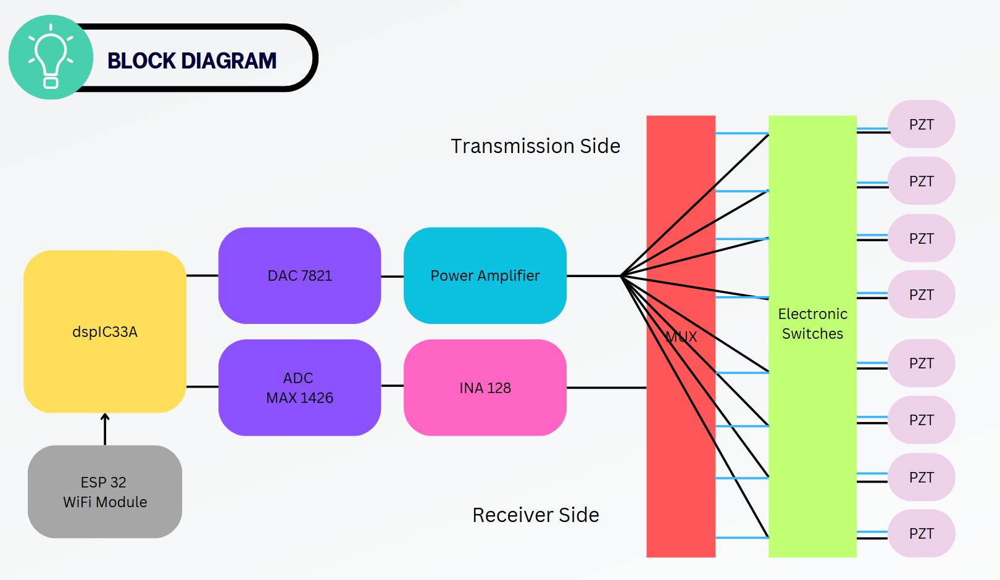

# Firmware Overview

This project involves two main microcontrollers — the **dsPIC33AK128MC106** and the **ESP32**, working in synchrony to perform data acquisition and communication over WiFi.

---

## dsPIC33AK128MC106 Firmware

The **dsPIC33AK128MC106** microcontroller is responsible for **low-level control** of the hardware, including analog signal acquisition, multiplexing, DAC output, and switching logic.

### Files and Their Responsibilities

- **`integrated.c`**
  - This file manages all the core hardware control functionalities:
    - **ADC (Analog-to-Digital Converter)**: Captures analog signals from selected sensors.
    - **DAC (Digital-to-Analog Converter)**: Outputs processed signals or control voltages.
    - **Multiplexer Control**: Selects one of many inputs to be routed for ADC/DAC operations.
    - **Electronic Switch Control**: Activates/deactivates specific parts of the circuitry based on the command received.
    - 

- **`command_protocol.c`**
  - Implements the custom **command parsing logic**.
  - Interprets incoming commands from the ESP32 via UART and maps them to appropriate actions (e.g., switch control, channel selection).
  - Works closely with the `integrated.c` module to set the system state accordingly.

- **`protocol_def.h`**
  - Header file containing definitions, constants, and macros related to the command protocol.
  - Ensures consistency across modules when referring to commands or states.

---

## GUI-Driven Command Flow

A custom GUI sends **structured commands** over UART to the **dsPIC33AK128MC106**. These commands follow a defined protocol:

1. GUI sends a command to the dsPIC via UART.
2. `command_protocol.c` interprets the command.
3. Based on the command:
   - The **Multiplexer** selects the appropriate input channel.
   - The **Electronic Switch** is toggled ON/OFF accordingly.
4. Signal acquisition or output happens via **ADC/DAC** as requested.

---

## System Overview Diagram

    [GUI] ← WiFi → [ESP32] ←UART→ [dsPIC33AK128MC106]
                                      |
                  ┌───────────────────┼────────────────────┐
                  ▼                   ▼                    ▼
              [Multiplexer]     [Electronic Switch]     [ADC/DAC]
